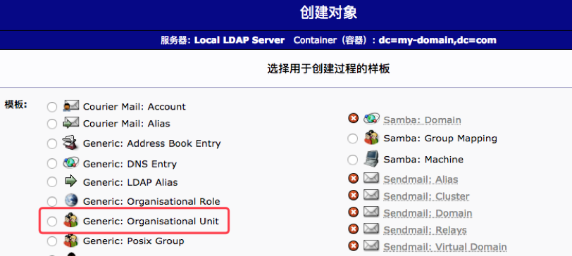
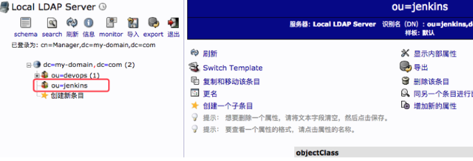
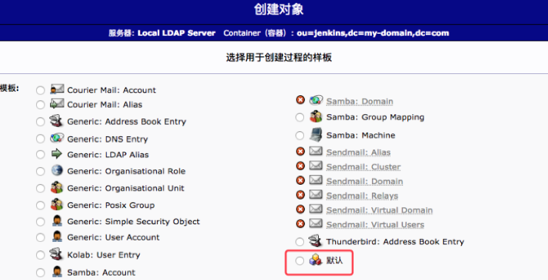
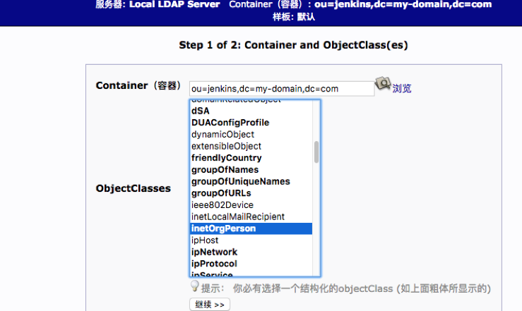
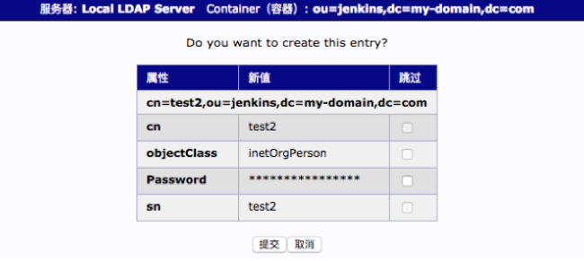
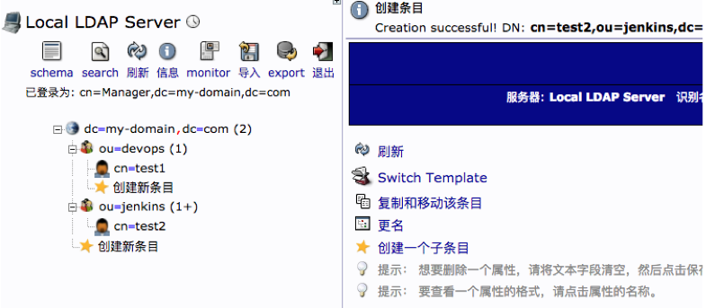
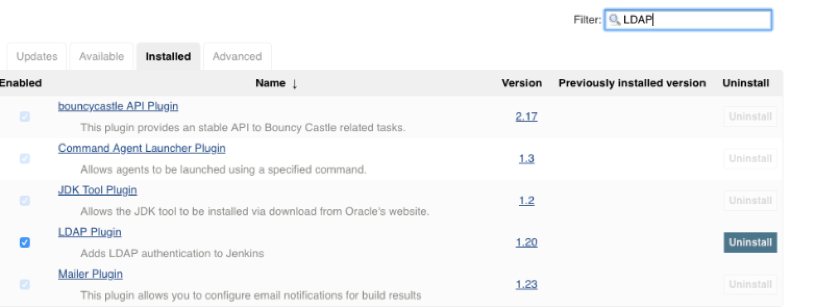
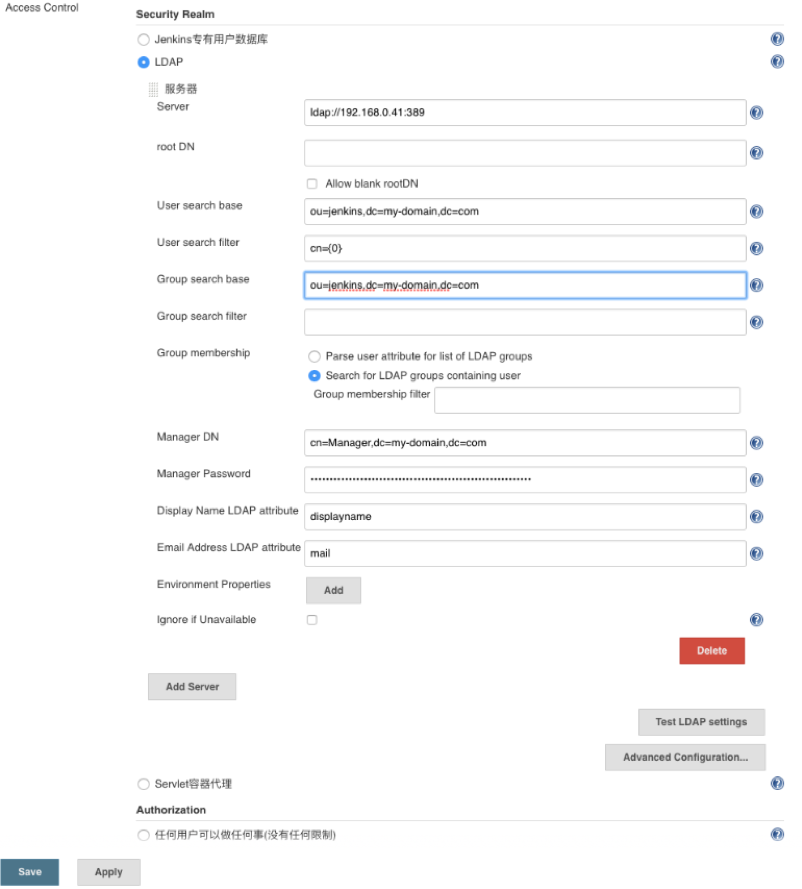
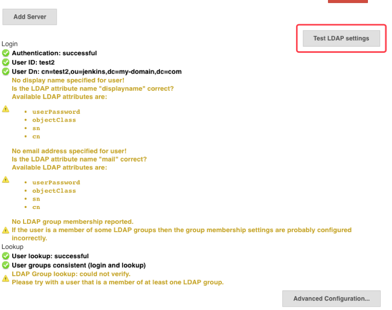

# 第四章 系统集成Jenkins
## 1. 安装LDAP
- 参考文档：https://www.cnblogs.com/mascot1/p/10498392.html

### 1.1 先决条件

```
#关闭SELINUX
vim /etc/sysconfig/selinux   # SELINUX=disabled
setenforce 0 

#关闭防火墙
systemctl stop firewalld	
systemctl disable firewalld

```


### 1.2 安装ldap
```
#安装ldap工具
yum install -y openldap-servers openldap-clients migrationtools  
slappasswd   #据提示输入密码会返回加密的密码字符串，保存好这个字符串

#配置数据库缓存
cp /usr/share/openldap-servers/DB_CONFIG.example /var/lib/ldap/DB_CONFIG 
chown -R ldap:ldap /var/lib/ldap/

#测试配置文件
slaptest -u  #出现configfile testing successed 说明成功了

#启动ldap
systemctl start slapd.service 
systemctl enable slapd.service

#导入模板
ls /etc/openldap/schema/*.ldif | xargs -I {} sudo ldapadd -Y EXTERNAL -H ldapi:/// -f {}
```


## 2. 安装LDAP控制台

### 2.1 先决条件
```
#安装apache
yum -y install httpd 

#修改配置文件
vim /etc/httpd/conf/httpd.conf #AllowOverride all

#启动服务测试
systemctl start httpd
systemctl enable httpd
    curl 127.0.0.1

```

### 2.2 安装phpldapadmin

```
#安装phpldapadmin
cat /etc/yum.repos.d/epel.repo 
[epel]
name=Extra Packages for Enterprise Linux 7 - $basearch
baseurl=https://mirrors.tuna.tsinghua.edu.cn/epel/7Server/x86_64/
enabled=1
gpgcheck=0


yum install phpldapadmin


```

### 2.3 更改配置文件

```
#修改配置文件
vim /etc/phpldapadmin/config.php
$servers->setValue('server','host','127.0.0.1');
$servers->setValue('server','port',389);
$servers->setValue('server','base',array('dc=my-domain,dc=com'));
$servers->setValue('login','auth_type','session');
$servers->setValue('login','attr','dn');

$servers->setValue('login','attr','dn'); #注释掉

#修改httpd配置文件
vim /etc/httpd/conf.d/phpldapadmin.conf 
Alias /phpldapadmin /usr/share/phpldapadmin/htdocs
Alias /ldapadmin /usr/share/phpldapadmin/htdocs

<Directory /usr/share/phpldapadmin/htdocs>
  <IfModule mod_authz_core.c>
    # Apache 2.4
    Require local
    Require ip 192.168.0
  </IfModule>
  <IfModule !mod_authz_core.c>
    # Apache 2.2
    Order Deny,Allow
    Deny from all
    Allow from 127.0.0.1
    Allow from ::1
  </IfModule>
</Directory>

#创建基础目录
vim /etc/openldap/base.ldif
dn: dc=my-domain,dc=com
o: ldap
objectclass: dcObject
objectclass: organization
    dc: my-domain

```


### 2.4 访问测试
```
#重启httpd服务
service restart httpd
#访问测试
http://192.168.0.41/phpldapadmin

```


## 3. LDAP创建组织
- 参考文档：https://www.cnblogs.com/mascot1/p/10498460.html

### 3.1 创建OU


- 选择Organisational unit 组织单元


- 输入OU名称


- 提交信息


- 查看结果



### 3.2 创建人员
- 选择OU->选择新建子条目


- 选择默认模板


- 选择inetorgperson


- 填写并提交信息


- 用户创建完成


## 4.Jenkins集成LDAP
- 参考文档：https://www.cnblogs.com/mascot1/p/10498513.html

### 4.1 先决条件
- 准备一个adminDN账号用于查询用户。 cn=Manager,dc=my-domain,dc=com
- 2.将访问Jenkins的用户放到一个OU中。 ou=jenkins,dc=my-domain,dc=com
- 3.提供ldap服务器地址。 ldap://192.168.0.41:389

### 4.2 Jenkins配置
- 安装ldap插件


- 全局安全配置


- 选择账号测试，出现一下信息集成完毕



### [下一章](./第七章-集成Jenkins(三).md)    <--------->  [上一章](./第五章-集成Jenkins(一).md)